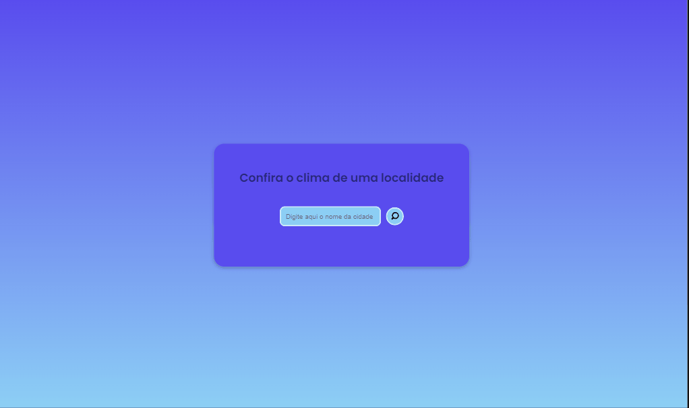

# Open-Weather-Map

 ## Veja como ficou o projeto:
  
  
  ## Do que se trata esse projeto?
Este projeto trata-se de uma página onde é possível buscar alguns dados do clima atual em uma determinada cidade.
Essa busca dinâmica é possível através de uma requisição feita a api pública [OPEN WEATHER MAP](https://openweathermap.org/).

## Quais interações são realizadas?
- O usuário pode pesquisar através do input qualquer cidade do mundo, que aparecerá alguns dados do clima da cidade correspondente.
- É possível saber a temperatura,o clima,a humidade,a sensação térmica e a velocidade do vento.

  
## Habilidades desenvolvidas:
- Uso de flexbox para ajustes dos elementos na tela.
- Uso e manipulação dos elementos no JavaScript,incluindo interpolação de strings.
- Uso do método fetch para realizar a requisição à API.
- Uso de funções assíncronas, eventos, condicionais.
- Uso de mediaqueries para responsividade.

## Linguagens Utilizadas:
- HTML 

- CSS  

- JAVASCRIPT  
          

Para ver o projeto pronto, [CLIQUE AQUI!](https://jessica-os.github.io/Open-Weather-Map/)
